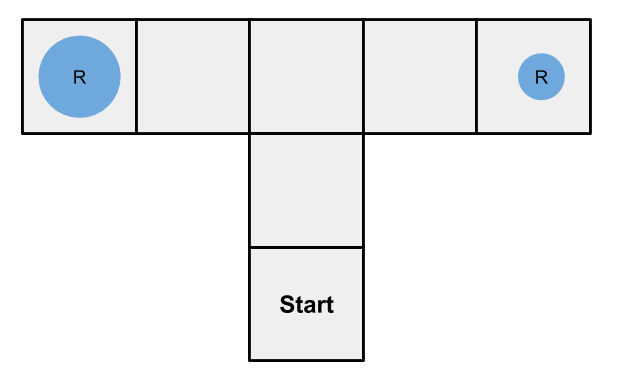

# Adventure Overview

This experiment is designed to evaluate SignalGP's function regulation. Agents are evolved to solve a classic learning task, T-maze navigation. 

The SignalGP function regulation demonstrated by this adventure is proof of concept. A more generic version of function regulation is a planned feature of the next version of SignalGP. 

## Special requirements
Requires version of SignalGP that implements function regulation. This is not currently a standard feature. To use function regulation, you'll need the SGP-FUNC-REG branch of my Empirical fork (amlalejini/Empirical). The next iteration of SignalGP will include function regulation; though, not in the exact same form as what I currently have implemented. 

# T-Maze task
From [Wikipedia](https://en.wikipedia.org/wiki/T-maze): A T-maze is a simple maze used in animal cognition experiments to study a subject's faculties for memory and spatial learning. 
The T-maze task has also been used to evolve learning/memory use in neural networks (Soltoggio et al., 2008). 

A T-maze is a maze that's, well, shaped like a T (see image below). A subject is placed in the start location, and rewards are placed in on both ends of the T where one reward is better than the other. 

A subject must navigate the maze to collect one of the rewards and then return to the start. This is repeated for several trials where the location of the larger reward is consistent. To maximize their reward, subjects must learn and remember the location of the larger reward.

Here, I'm using a T-maze task to evaluate SignalGP function regulation. The idea is that function regulation gives SignalGP agents a way to regulate their response to external events/inputs in response to feedbacks, (perhaps) making it easier to encode within-evaluation learning. 

## Implementation-specific Details
How am I actually coding up these t-maze evaluations? 

General note: the experiment implementation is implemented as a web of Empirical Signals. This makes tracing program flow to figure out what exactly is going on more challenging, but it makes the experiment itself more easily configurable. 

**Sensing**  
How do agents sense their location in the grid? There are a few sensing options that could be made available to agents:
- Auto-trigger events (corresponding to current grid position) everytime we need an action (i.e. actions are given in response to events). E.g., there would be an initial 'start' event, and every time the agent performs an action before time is up, there would be an event corresponding to the grid cell the agent is currently occupying. Or, only trigger an event when an event moves to a *new* cell. 
- Sense-trigger events. Events (corresponding to the current grid position) are triggered at the request of a SignalGP agent via the execution of an instruction. 
- Sense instruction. Executing an instruction provides sensory information in memory locations specified by instruction-arguments. 

**Actuation**  
How should agents actuate? I.e., how should agents move through the maze? Again, a few options:
- Give T total time where agents are always executing instructions. When an agent executes an actuation instruction, the actuation is done, and execution continues (events may be triggered, etc). 
- Treat the SignalGP agents more like neural networks. Give them T time steps *per-actuation*. Between actuations, kill all active threads. We can wipe/not wipe shared memory and function reference modifiers (function regulation). 

# TODOs
- Test full evaluation (single/multiple trials)
- Add big/small reward cnt tracking
- Add location polling sensors
- handcode solutions that use different strategies
  - function regulation, shared memory, naive
- GetRewValue instruction
- Solve problem: bootstrapping movement (no incentive to move in maze
  - Could switch from Rotation ==> Rotation + forward

# References
Soltoggio, A., Bullinaria, J. A., Mattiussi, C., Dürr, P., & Floreano, D. (2008). Evolutionary Advantages of Neuromodulated Plasticity in Dynamic, Reward-based Scenarios. Artificial Life XI: Proceedings of the 11th International Conference on Simulation and Synthesis of Living Systems (ALIFE 2008), 2, 569–576. https://doi.org/10.1.1.210.6989